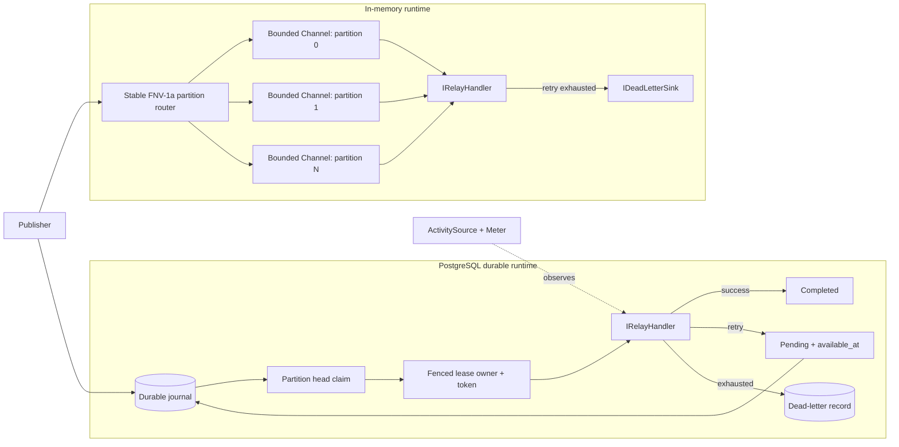
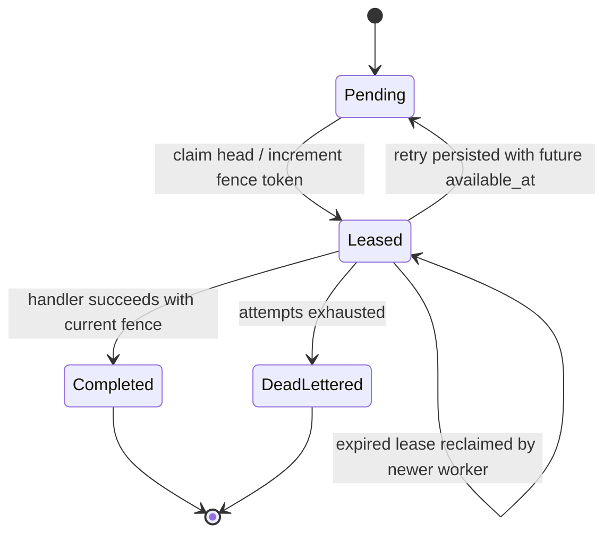

# Architecture

RelayGrid has two execution layers that share the same ordering model: an in-memory bounded runtime for local processing and an optional PostgreSQL journal for durable multi-worker execution.

## System view

### Invariants at a glance

| Concern | RelayGrid behavior |
| --- | --- |
| Admission | Each in-memory partition is bounded; publishers wait when the selected partition is full. |
| Routing | Stable FNV-1a over the partition key selects a partition deterministically. |
| Ordering | One reader per in-memory partition; the durable journal only claims the earliest active row in a partition. |
| Concurrency | Different partitions can progress concurrently. |
| Retry | Deterministic capped exponential backoff in memory; durable retries persist `available_at` and continue blocking later work in that partition. |
| Worker safety | Durable state transitions require the current lease owner and exact monotonically increasing fence token. |
| Dead letter | Exhausted durable work changes state and writes its dead-letter record in the same PostgreSQL transaction. |
| Observability | Durable workers expose standard .NET `ActivitySource` and `Meter` instrumentation. |

## In-memory admission and partitioning

Each runtime partition owns a bounded `Channel<RelayEnvelope>`. `PublishAsync` routes with stable FNV-1a and waits when the target partition is full. Each partition has one reader, so accepted work is FIFO within that partition while different partitions can run concurrently.

## Durable journal

The PostgreSQL layer stores every envelope with a monotonic `BIGSERIAL` sequence and explicit partition index. Durable states are `Pending`, `Leased`, `Completed`, and `DeadLettered`.

### Partition head rule

A claim first identifies the lowest-sequence pending or leased row for a partition. Only that row may become a candidate. If it has a future retry time or an unexpired lease, the claim returns no work. Later rows cannot overtake it.

The candidate row is locked with `FOR UPDATE ... SKIP LOCKED`, allowing separate partitions and separate database workers to make progress without double-claiming the same head row.

### Fencing

Every successful claim increments `fence_token`. Completion, retry, and dead-letter transitions require message ID, current lease owner, and exact fence token. Once an expired lease is reclaimed, an older worker is stale and its transition affects zero rows, which RelayGrid surfaces as `StaleRelayLeaseException`.

### Retry and dead letter

Retry moves the current leased head back to `Pending`, records failure metadata, and sets `available_at`. Because it remains the earliest active row, later work in that partition stays blocked until the retry becomes claimable or is terminally resolved.

Dead-lettering updates the message and inserts its dead-letter record in one PostgreSQL transaction. A failure before commit leaves the original lease intact rather than exposing a half-transition.

## Schema application

Schema version 1 is an embedded SQL resource. Application runs inside a transaction guarded by a PostgreSQL advisory transaction lock. Re-applying the same version is idempotent.

## Failure and recovery model

An older worker that tries to transition a reclaimed item no longer owns the current fence token, so the stale transition is rejected rather than overwriting newer work.

## Boundaries

The durable journal provides persistence, ordering and fencing primitives. It does not by itself provide exactly-once handler execution or durable cross-message idempotency. Those require additional protocol semantics beyond storing a successful row transition.
